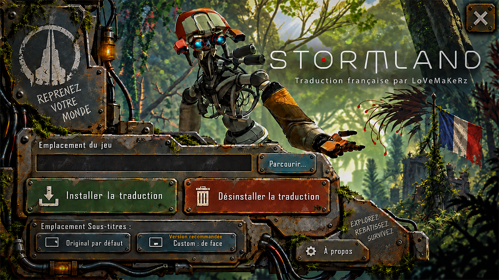
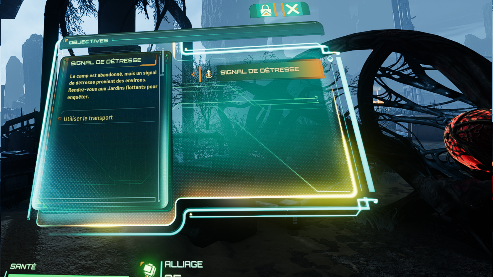

# Stormland — Traduction française V1.1

Traduction française non officielle de **Stormland**, réalisée par **LoVeMaKeRz**.

L’objectif du projet est de rendre l’aventure accessible en français tout en conservant au maximum le ton, le contexte et l’ambiance du jeu original.

La traduction couvre notamment :

- les dialogues ;
- les sous-titres ;
- les interfaces ;
- les objectifs ;
- les descriptions ;
- les journaux et textes du jeu.

Un important travail de contextualisation et de relecture a été effectué afin d’éviter autant que possible les traductions littérales et de proposer un français naturel et cohérent avec les personnages, les missions et les situations rencontrées.

---

## Télécharger

### Installation automatique — recommandée

Téléchargez la dernière version depuis la page **Releases** du dépôt :

**[Télécharger Stormland — Traduction française V1.1](LIEN_RELEASE_GITHUB)**

L’installateur est **portable** :

- aucune installation dans Windows ;
- aucun programme permanent ajouté au système ;
- aucun script à manipuler ;
- installation et désinstallation automatisées ;
- choix indépendant du placement du module de texte.

Il suffit de télécharger l’installateur, de le lancer et de choisir l’action souhaitée.

---

## Installation

Fermez **Stormland** avant toute modification.

Lancez l’installateur puis, si nécessaire, indiquez le dossier du jeu avec **Parcourir**.

### Installer la traduction

Cliquez sur :

**Installer la traduction**

L’installateur applique automatiquement les fichiers français de la **V1.1**.

### Désinstaller la traduction

Cliquez sur :

**Désinstaller la traduction**

L’installateur restaure les textes anglais tout en conservant le placement actuel du module de texte.

---

## Placement des sous-titres / textes

Stormland affiche normalement son module de texte sur la droite du champ de vision.

Le projet propose également un placement alternatif spécialement conçu pour améliorer la lecture en VR.

### Original par défaut

**Original à droite**

Conserve le comportement natif de Stormland.

Le module de texte reste positionné sur la droite, comme dans le jeu d’origine.

### Custom : de face

**Custom : de face**

Déplace le module de texte directement devant le joueur, légèrement vers le bas.

Ce placement a été conçu et validé afin que les dialogues et informations soient plus faciles à lire naturellement en VR, sans devoir tourner systématiquement la tête vers la droite.

Le choix du placement est indépendant de la traduction : vous pouvez changer de mode sans réinstaller toute la traduction.

---

## Version manuelle Xdelta

Une édition manuelle **Nexus-Friendly** est également disponible pour les utilisateurs qui préfèrent appliquer le patch eux-mêmes.

Lien Nexusmods ( jeu existe pas sur la plateforme, c'est en cours de validation ) : Lien a venir

Cette version utilise uniquement des fichiers **Xdelta/VCDIFF**  :

Elle permet notamment d’installer :

- **FR + Original à droite** ;
- **FR + Custom de face** ;
- **Anglais + Custom de face**.

Les instructions détaillées sont fournies directement dans l’archive Xdelta.

---

## Qualité de la traduction

Le projet ne repose pas sur une simple traduction automatique appliquée en masse.

Pour les dialogues, les lignes précédentes et suivantes ont été étudiées autant que possible afin d’identifier :

- le personnage qui parle ;
- le contexte de la scène ;
- l’objectif en cours ;
- la situation dans laquelle la phrase est utilisée ;
- les variantes de dialogue associées.

Certaines formulations ont donc volontairement été adaptées plutôt que traduites mot à mot afin d’obtenir un résultat plus naturel en français.

Une attention particulière a également été portée à la cohérence des termes, des objectifs, des éléments de gameplay et des différentes variantes de dialogues.

### État du corpus

Le corpus identifié comporte actuellement :

**4 398 entrées au total**

**4 384 entrées traduites**

Soit environ **99,68 %** du corpus identifié.

Les **14 entrées restantes sont des exclusions connues** pour lesquelles le contexte ou l’utilisation réelle ne permettaient pas de produire une traduction suffisamment fiable sans inventer.

Elles ont volontairement été laissées intactes plutôt que traduites au hasard.

---

## Une traduction encore perfectible

Stormland comporte des dialogues réactifs, des variantes de missions et certaines lignes susceptibles de n’apparaître que dans des situations très spécifiques.

Il peut donc encore subsister exceptionnellement :

- une phrase en anglais ;
- une variante rarement déclenchée ;
- une petite erreur de contexte ;
- une formulation pouvant être améliorée.

Si vous trouvez un problème, vous pouvez le signaler dans les **Issues GitHub** en indiquant si possible :

- la phrase affichée ;
- le moment du jeu ;
- le contexte de la scène ;
- une capture d’écran.

Ces informations permettent de retrouver beaucoup plus facilement l’entrée concernée et d’améliorer une future version.

---

## Compatibilité

Cette traduction est destinée à **Stormland sur PC VR**.

Elle modifie uniquement les ressources nécessaires à la traduction et, lorsque l’option correspondante est utilisée, le placement du module de texte.

Le patch ne contient pas le jeu original.

Une **copie légitime de Stormland est indispensable**.

Si une future mise à jour du jeu modifie les fichiers concernés, une mise à jour du patch pourra être nécessaire.

---

## Version actuelle

**Traduction française : V1.1**

**HUD Original :** emplacement natif à droite.

**HUD Custom : de face :** placement personnalisé face au joueur pour améliorer la lisibilité en VR.

---

## À propos

**Stormland — Traduction française non officielle**  
**Traduction française réalisée par LoVeMaKeRz**

Projet communautaire gratuit et non affilié, approuvé ou sponsorisé par les détenteurs des droits de **Stormland**.

Stormland, ses marques, personnages, visuels et autres éléments associés restent la propriété de leurs détenteurs respectifs.

Ce patch nécessite une copie légitime de Stormland et ne contient pas le jeu original.

---

## Remerciements

Merci à toutes les personnes ayant participé aux tests, aux vérifications et aux retours pendant le développement de cette traduction.

Et comme toujours, merci à ma femme, qui a encore dû attendre plus d’une fois que je termine « juste un dernier test » avant de venir manger ou dormir ^^’

**Bon retour dans les nuages, et bonne aventure en français !**
